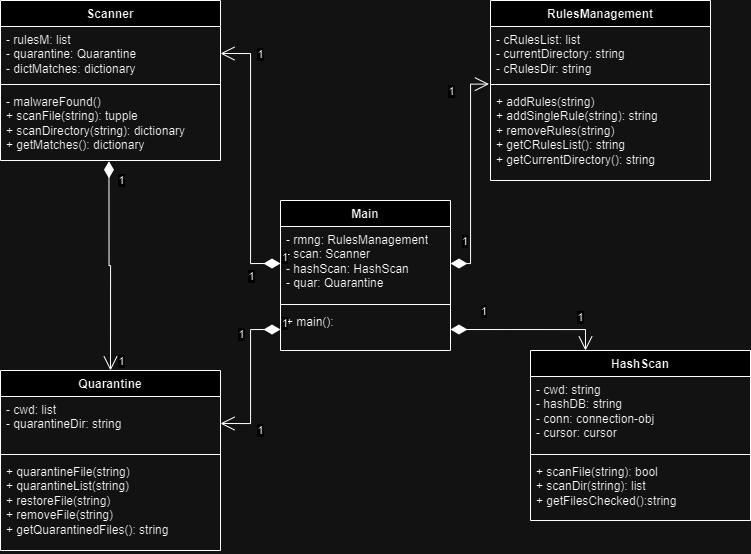
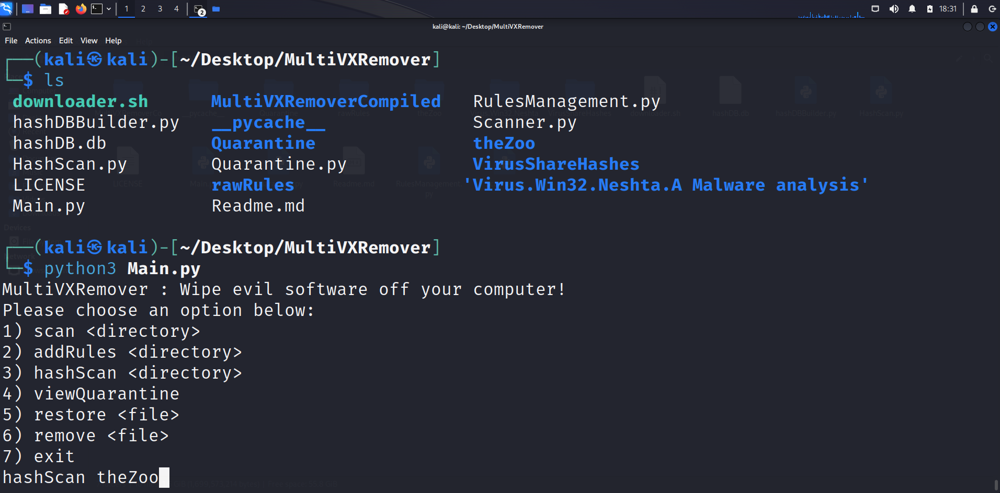
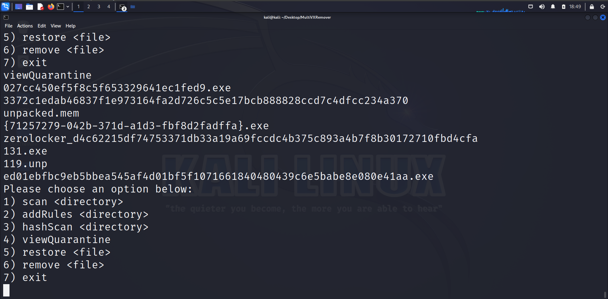

# MultiVXRemover

## Conceito do projeto
Projeto de mini-antívirus, que consegue detectar assinaturas de malwares conhecidos assim como colocá-los em "quarentena". Foi feito inteiramente em python com ajuda da biblioteca de regras YARA. Adicionalmente,inclui uma breve pesquisa sobre o vírus de computador conhecido como Neshta, com sua análise dinâmica e estática.

Todos os softwares desenvolvidos contém padrões exclusivos, que permitem indentificá-los em meio a tantos outros. O mesmo acontece com malwares. Um dos mecanismos mais úteis dos antivírus modernos é justamente a detecção por assinatura, que consiste em catalogar diversos desses "padrões" de vírus em uma base de dados e compará-los com os arquivos presentes no computador do usuário. Um "match" provavelmente significa que aquele arquivo é um malware já conhecido e que portando deve ser isolado pela segurança do cliente.

Dois tipos de assinatura são utilizados para detecção de software maliciosos nesse projeto:
* Regras YARA: consiste em um conjunto de expressões regulares aplicadas ao binário. Consegue dar "match" tanto em bytes "raw", strings de texto e combinar os diferentes "matches" que ocorreram com expressões lógicas. É o mecanismo principal de detecção. Consegue detectar malwares e possíveis "variantes" desse software malicioso. 
* Hash MD5: O hash é como uma "somatório do conteúdo de um arquivo". A função hash, no caso o MD5, recebe um arquivo de tamanho arbitrário e produz uma string fixa que é potencialmente exclusiva para esse arquivo. É bastante inflexível, uma mínima alteração muda completamente o hash, sendo muito específica para indetificar um sofware único. A vantagem é que apenas softwares já catalogados com esse hash serão efetivamente detectados, com menor probabilidade de um "match" errôneo

A interface do programa é inteiramente textual. Apoós a execução, será fornecido um terminal para inserção dos comandos, que seguem o padrão:
nome_comando < parâmetro >

## Pré-requisitos e recursos utilizados
O MultiVXRemover foi feito inteiramente em python, sendo necesssário um interpretador da linguagem para poder executar o programa.
Foram utilizadas as seguintes bibliotecas
* OS, para operar com arquivos. Padrão do python
* lib-yara, biblioteca que da suporte as regras yara
* yara-python, integração da biblioteca com python
* sqlite3, para construção do BD de hashes md5.Padrão do python

O projeto inclui um set de regras YARA obtidos da Reversing LABS. O projeto original pode ser encontrado [nesse link](https://github.com/reversinglabs/reversinglabs-yara-rules)

Além disso, inclui um "scraper" escrito em bash "downloader.sh" para hashes MD5 do site vírus share. Há uma coleção **gigantesca** de assinaturas de vírus coletadas da internet. O download de todos os arquivos pode demorar algum tempo, mas se desejar, adicione sesu próprios hashes para teste.
  
## Passo a passo
Para a realizar o projeto, fizemos a seguinte sequência de etapas:
1. Pesquisa inicial sobre o funcionamento de malwares e sua detecção:
 Aqui entra nosso estudo de caso sobre o vírus Neshta. O vírus em particular continha uma string bastante única que o identificava em relação a outros softwares. Foi aqui que descobrimos o mecanismo de deteção por assinatura dos antivírus. As análises podem ser vistas na pasta Virus.Win32.Neshta.A Malware analysis
2. Passamos para a implementação:
 Seria necessário alguma biblioteca que permitisse executar ações de "match" contra arquivos. No ramo de segurança, a biblioteca YARA é bastante utilizada para esse fim
3. Projeto do programa:
 Seguimos o paradigma de programação orientado a objetos. Para isso, criamos um programa principal Main.py responsável apenas por comunicação com usuário. O Main integra os outros  módulos. Entre eles temos:
  * RulesManagement, responsável por gerenciar as regras YARA
  * Scanner, que analisa um diretório e retorna uma "associação" entre caminho do arquvo com o nome técnico do malware detectado (se houver)
  * Quarantine, que remove um arquivo e o transforma em base64, de forma que ele não seja executável
  * HashScan, que faz um scan alternativo com hashes. Utiliza o banco de dados sqlite tentando encontrar um "match"
  Diagrama de classes abaixo 
  
4. Codificação:
  Uma vez definida a estrutura passamos para a implmentação. Utilizamos [a documentação oficial do YARA](https://yara.readthedocs.io/en/stable/yarapython.html) e do [python](https://docs.python.org/3/library/os.html) para nos auxiliar

## Instalação
Alguns preparativos precisam ser feitos para que seja possível executar o programa. Os passos serão dados para o Linux, supõe-se que esse aplicativo será executado em um ambiente seguro, desconectado da internet e em uma máquina virtual.
1. Instale o yara:
```bash
sudo apt install yara
```
2. Instale o gerenciador de pacotes do python, o pip:
```bash
sudo apt install python3-pip
```
3. Instale o módulo yara para o pyhton:
```bash
pip install yara-python
```
Obs: talvez seja necessário installar libssl-dev primeiro, caso dê erro
4. Baixe o conjunto de hashes do virusshare, basta executar downloader.sh
```bash
./donwloader.sh 
```
Obs: essa etapa pode demorar uns 30 minutos. Interrompa a qualquer momento o download se não quiser baixar todos os hashes
md5. Monte o banco de dados sqlite. Essa etapa é bem mais rápida que a primeira
```bash
python3 hashDBBuilder.py
```
6. Execute o programa para atestar se tudo está certo:
```bash
pyhton3 Main.py
```

## Execução
A execução é bastante direta, apenas digite:
```bash
pyhton3 Main.py
```
E o programa estará em execução. Adicione as regras incluidas no app:
```
addRules rawRules
```
O programa suporta adição constante de novas regras. Para fins de teste, vamos inserir uma [regra para detectar o falso vírus EICAR](https://github.com/airbnb/binaryalert/blob/master/rules/public/eicar.yara)

Em outro terminal, insira essa comando para gerar o "virus":
```bash
mkdir teste
echo 'X5O!P%@AP[4\PZX54(P^)7CC)7}$EICAR-STANDARD-ANTIVIRUS-TEST-FILE!$H+H*' > ./teste/eicar
```
E escanear com:
```bash
scan teste
```

O "vírus" será neutralizado e colocado em quarentena. No caso, ele simplesmente é codificado para base64, um formato puramente textual e não executável. Outras informações são adicionadas para permitir sua restauração no mesmo local onde foi deletado

Veja sua quarentena com:
```bash
viewQuarantine
```
Restaure o eicar
```bash
restore eicar
```

O scan de hash funciona da mesma forma. Atente-se com uma demora extra para verificar os arquivos, uma vez que será necessário comparar o hash com uma grande base de dados.

## Bugs/problemas conhecidos
Por ter sua detecção baseado apenas em assinaturas, o MultiVXRemover não é capaz de detectar os chamados malwares metamórficos/polimórfimos ou ameaças recentes. De forma resumida, malwares que mudam sua forma (sua assinatura) "espontaneamente" ou que acabaram de serem criados não serão detectados por regras estáticas, que ficam muito limitadas aos softwares que as deram origem. Soluções de antivírus modernas incluem análise heurística e em tempo real da atividade de cada software no PC, se concentrando mais **na ação** do programa do que no **seu código**. 

A compilação das regras YARA geralmente será rápida, porém, o download e criação do banco de dados SQL dos hashes pode levar algum tempo, cerca de 30 minutos. A detecção com hashes também sofre do mesmo problema, demorando relativamente bastante tempo para comparação do hash de um arquivo com o banco de dados. Tentativas de otimização foram feitas para acelerar o processo, sendo que a organização em banco de dados sqlite foi a mais promissora.

A organização em forma de classes possui um alto "acoplamento" entre as classes, o que torna o código mais difícil de ser expandido futuramente

A quarentena utilizando o scan com regra yara está um pouco confusa. A quarentena é utilizada diretamente pelo Scanner, mas é o Main que deveria fazer isso.

## Autores
* [Rafael Barbeta](https://github.com/rafaelbarbeta)
* [Victor Motta](https://github.com/maxproyt)

## Demais anotações e referências
Encoraja-se fortemente o uso dessa ferramenta em um ambiente controlado e seguro como uma máquina virtual. Esse projeto NÃO substitue um antivírus profissional. Os criadores não serão responsáveis por quaisqueres incidentes que ocorram devido ao uso desse software.

## Imagens/screenshots



